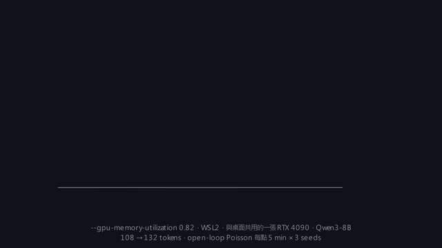
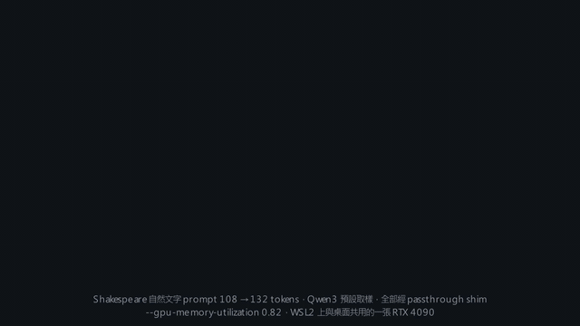
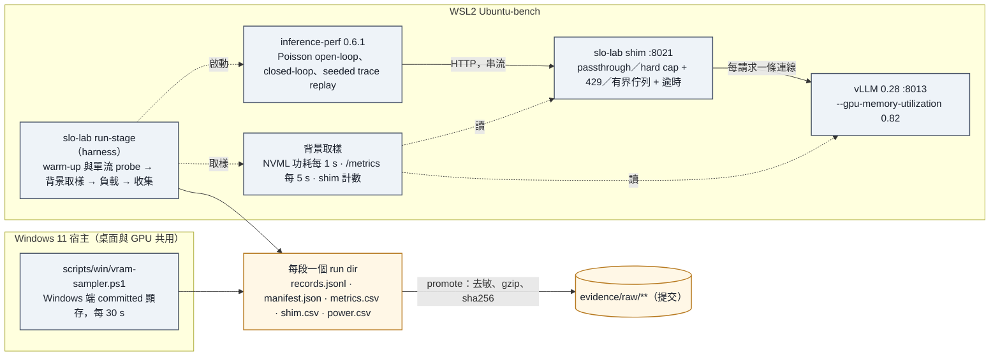
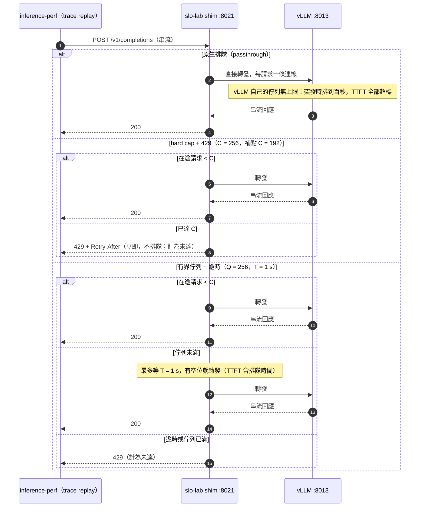

# vllm-single-gpu-slo-lab

[](LICENSE) [](https://github.com/kuotunyu/vllm-single-gpu-slo-lab/actions/workflows/ci.yml)

在 SLO 約束下（TTFT p95 ≤ 1 s 且 TPOT p95 ≤ 50 ms），量 Qwen3-8B 在單張 GPU 上的容量、能耗、品質與流量控制：四種精度、三種 admission 策略、speculative decoding。每個數字都由提交的證據以 `make reproduce` 重建，出處在 `analysis/claims_audit.md`。

量測條件：vLLM 0.28、WSL2、一張與桌面共用的 RTX 4090、`--gpu-memory-utilization 0.82`、108 → 132 tokens、open-loop Poisson、每點 3 seeds。數字只對這組條件成立；適用範圍與限制在 `docs/model-card.md`。

## 結果

### 四種精度（W2，ADR 0009）

| 精度 | r_SLO（req/s） | r_sat（req/s） | 能耗（Wh／百萬 output token） | TMMLU+ 全集 | 對 BF16 配對差 |
|---|---|---|---|---|---|
| BF16 | 10.26 | 11.40（`--max-num-seqs` 40 封頂） | 74.6 | 0.5911 | — |
| **FP8** | **26.2** | 41.35（下界） | **31.2** | **0.5909** | −0.02 pts（p = 0.945） |
| AWQ | 22.61 | 30.15 | 36.2 | 0.5797 | −1.13 pts（p = 7.0 × 10⁻⁶） |
| GPTQ-Int4 | 22.70 | 30.26 | 36.3 | 0.5703 | −2.08 pts（p = 1.4 × 10⁻¹⁶） |

FP8：SLO 容量是 BF16 的 2.55 倍、每 token 能耗 42 %、品質無法區分。4-bit 單流快約 2.5 倍，但飽和吞吐比 FP8 低 27 %，品質顯著下降。r_SLO 是所有 seed attainment ≥ 95 % 的最高 offered rate，膝點由 TPOT 決定、對 TTFT 門檻不敏感（ADR 0007–0008）。

<details><summary>示意動畫（42 秒）</summary>



動畫只重述表內數字，不是證據（`scripts/manim/`；完整版 `docs/media/w2-knee.mp4`）。
</details>

### 突發流量下的三種 admission（W3，ADR 0013、0018）

1.5 倍、5 分鐘的單峰突發，三種策略重播同一條 trace（3 seeds），整段 SLO attainment：

| | 原生排隊 | hard cap + 429 | 有界佇列 + 1 s 逾時 |
|---|---|---|---|
| FP8（C = 256） | 0.19 | 0.57 | 0.59 |
| BF16（C = 40） | 0.47 | 0.87 | 0.86 |

限流讓 attainment 提高約 0.4、突發後 10 s 內恢復（原生排隊要 3.5 到 14 分鐘），代價是拒絕 12 到 21 % 的請求。上限 C 必須在突發下仍 TPOT 安全：FP8 的 C 由 256 改 192，突發段 attainment 0.01 → 0.49、整段 0.57 → 0.78、拒絕率只多 1 個百分點（ADR 0018，非預註冊補點）。

<details><summary>示意動畫（61 秒）</summary>


動畫只重述表內數字，不是證據（完整版 `docs/media/w3-admission-burst.mp4`）。
</details>

### Speculative decoding（W4，ADR 0016）

| cell | 接受率 | 單流 TPOT | 吞吐比 c = 8 / 32 / 128 / 256 | 同 rate 的 TPOT p95 差 | r_sat（對 none） |
|---|---|---|---|---|---|
| 8B FP8 + n-gram | 0.52 | 1.72× | 1.28 / 1.17 / 0.85 / 分頁 | +1.7 到 +3.8 ms | 26.7（40.2） |
| 4B + EAGLE-3 | 0.27 | 1.45× | 1.45 / 1.20 / 0.66 / 0.60 | −2 ms（≤ 12 rps）、+10 ms（24 rps） | 28.8（47.6） |
| 4B + n-gram | 0.53 | 1.12× | 1.09 / 1.04 / 0.73 / 0.67 | +1.6 到 +4.1 ms | 32.1（47.6） |

單流與小批次變快，c = 128 起吞吐反轉；同 rate 的 attainment 與 r_SLO 和 none 相同、TPOT 中位數降而 p95 升：典型請求變快、尾端變慢，以 p95 定義的 SLO 下容量沒有增加。8B n-gram 在 256 並行時超出記憶體預算而分頁，高負載點量不到。

<details><summary>示意動畫（40 秒）</summary>



動畫只重述表內數字，不是證據（完整版 `docs/media/w4-specdec.mp4`）。
</details>

## 實驗方法

| 軸 | 水準 | 問題 |
|---|---|---|
| 精度 | BF16、FP8、AWQ、GPTQ-Int4 | 每精度的 r_SLO、Wh／百萬 token、TMMLU+ |
| Admission | vLLM 原生排隊、硬上限 C + 429、有界佇列 Q + 逾時 T | 突發下 attainment、goodput、拒絕率的取捨 |
| Speculative decoding | none、n-gram（8B 與 4B）、EAGLE-3（4B） | 低／高 rate 下 TPOT 與容量的變化 |

- **SLO attainment**：量測窗內同時達 TTFT 與 TPOT 門檻的請求比例；5xx、timeout、429 都算未達，分母是 offered。
- **r_SLO**：open-loop 掃描中所有 seed attainment ≥ 95 % 的最高 offered rate；同一份紀錄另算 TTFT {0.5, 1, 2} s × TPOT {30, 50, 100} ms 的敏感度網格。
- 定值凍結在 `analysis/preregistration.md`；偏離都有 ADR。



<details><summary>Admission 三策略的請求流程（時序圖）</summary>


</details>

## 重現性

```bash
uv sync --all-extras          # vLLM 與 torch 不在依賴裡：本套件只做 CPU 端的分析、shim 與量測工具
make test                     # 191 個測試
make audit-secrets            # 掃 IP／金鑰／token
make reproduce                # 從 evidence/ 重建所有表、圖與 run ledger，diff 必須為空（CI 每次 push 執行）
```

- 證據規格與資料流：`evidence/README.md`；每個數字的出處、n、CI：`analysis/claims_audit.md`
- 決策紀錄：`docs/decisions/0001`–`0018`；model card：`docs/model-card.md`；授權：`docs/licences.md`
- 量測主機的操作：`docs/runbook-wsl2.md`；模組與證據清單：`docs/inventory.md`；交接：`docs/HANDOFF.md`

相關專案：[`local-inference-bench-gateway`](https://github.com/kuotunyu/local-inference-bench-gateway) 比較桌面級 engine 與 gateway 的 429 語意；本專案只用 vLLM，回答 SLO 下的容量、能耗與流量控制。
